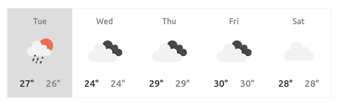
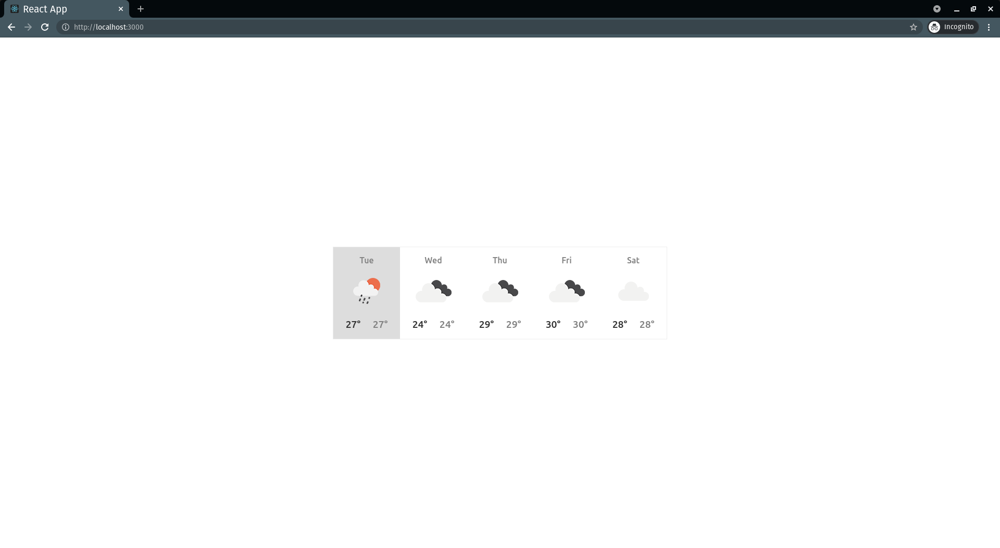

# React Weather API

A simple Weather API using React as the frontend framework.

## Part 1

The specific data that we'll want to have is the high and low temperatures for today and the next 4 days of any location of our choice (location could be hardcoded), along with some data that will help us decide which weather icon to display (this could be an ID or a string such as "partially cloudy", it will depend on the API we choose).

For this API demonstration, we'll use the [OpenWeatherMap API](https://openweathermap.org/api), which is free for use, but will require us to sign-up to get an API key (most APIs will).

## Part 2

The next step is to display the data for today, and match the following mock:

We want to use the data that was received from the API to do sot. Note: you may have to convert the min and max temperatures from Kelvin to Centigrade or Fahrenheit.

## Part 3

The third and last step of the assessment is to expand what you wrote in part 2 to create a 5 day forecast that looks as follows:

When finished, the application should look like this:

